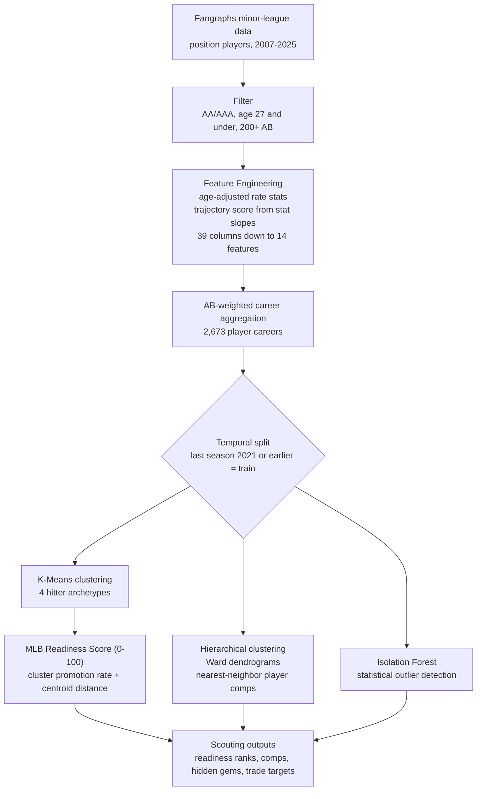

# MLB Prospect Call-Up Readiness Engine

**Unsupervised machine learning for minor-league hitter evaluation, 2007-2025.**

This project turns a fuzzy scouting question, whether a prospect is ready for the majors, into quantified outputs a front office can rank and act on. It puts a 0-to-100 readiness number on every hitter, finds big-league comparables for the harder-to-read minor leaguers, and digs up statistically unusual players who fall outside the published top-100 lists.

<p>
  
  
  
  
  
  
</p>

---

> ### TL;DR
> - **Problem.** Timing a prospect's call-up is one of the trickiest calls a front office makes. Too early can dent a young hitter's confidence for years. Too late can sour the relationship and burn value. The decision runs mostly on judgment, and judgment is hard to scale across a whole farm system.
> - **Approach.** I built an unsupervised pipeline over 2,673 minor-league hitter careers and ran four complementary methods on it: K-Means for archetypes, a composite readiness score, Ward hierarchical clustering for player comps, and an Isolation Forest for hidden gems.
> - **Outputs.** A 0-to-100 readiness score that predicts call-up status on a held-out test set at 63% accuracy, big-league comps for prospects (one minor leaguer grades out near Mike Trout), and three under-the-radar outlier prospects sitting outside MLB's top 100.


---

## Table of Contents
1. [The Problem](#1-the-problem)
2. [What Makes This Hard](#2-what-makes-this-hard)
3. [System Overview](#3-system-overview)
4. [The Data](#4-the-data)
5. [Feature Engineering](#5-feature-engineering)
6. [Clustering Hitters into Archetypes](#6-clustering-hitters-into-archetypes)
7. [The MLB Readiness Score](#7-the-mlb-readiness-score)
8. [Finding Player Comparisons](#8-finding-player-comparisons)
9. [Hunting for Hidden Gems](#9-hunting-for-hidden-gems)
10. [Scouting Takeaways](#10-scouting-takeaways)
11. [Limitations](#11-limitations)
12. [Future Directions](#12-future-directions)
13. [Tech Stack](#13-tech-stack)
14. [Repository Structure](#14-repository-structure)
15. [Reproducing the Pipeline](#15-reproducing-the-pipeline)
16. [About the Author](#16-about-the-author)

---

## 1. The Problem

Deciding when to call a hitter up from the minors is one of the most delicate calls a baseball front office makes. Bring him up too early and a rough stretch can dent his confidence for years. Leave him buried too long and the player starts to wonder whether the organization believes in him, or whether they are quietly gaming his service-time clock to save money. Some call-ups are not really decisions at all, just a roster patch when someone gets hurt.

I wanted to take some of the guesswork out of that call. The plan was to quantify call-up readiness for minor-league hitters with unsupervised learning. Alongside that, I set out to surface hidden gems sitting outside the published top-prospect lists, and to find big-league statistical comps for the prospects who are tougher to read.

A bit of prior research framed the approach. One older study found that psychological and coping skills explain about as much variance in batting average as physical tools do (Smith and Christensen, 1995). More recent work shows granular Statcast inputs like exit velocity and launch angle predict big-league success better than traditional box-score numbers (Malhotra, Maheshwari, and Singh, 2022). Machine learning has a track record on the problem too, with one approach reporting a 36.9% accuracy gain over prior methods (Bogen, 2023).

---

## 2. What Makes This Hard

There is no clean label for "ready." A prospect either gets called up or he does not, and that outcome turns on a pile of things that have little to do with talent: roster construction, service-time strategy, big-league injuries, organizational depth at his position. Using call-up as a stand-in for readiness means the target is noisy from the very start.

That noise shapes the entire design. A few of the structural challenges:

| Challenge | Why it bites | The response in this project |
|---|---|---|
| **No ground-truth readiness label** | Call-up depends on roster math and money, not just talent | Unsupervised methods that learn structure from the stats, with call-up used only as a loose external check |
| **Comparing across ages and levels** | A 20-year-old in AAA and a 24-year-old in AA are not on equal footing | Age-adjusted rate stats keyed to each level-season's average age |
| **Uneven season lengths** | A .300 average in 50 at-bats is not a .300 in 400 | Career aggregation weighted by at-bats, so big samples count more |
| **Unusual does not mean good** | Statistical uniqueness can be elite or just strange | Outlier flags paired with the readiness score before anything gets called a gem |

The whole project is an attempt to wring a usable signal out of a target that stays fundamentally murky. The write-up is upfront about where that murkiness shows through.

---

## 3. System Overview



---

## 4. The Data

The source is a custom Fangraphs minor-league dataset, aggregated by player and season.

| Filter | Setting |
|---|---|
| **Players** | Position players only |
| **Levels** | AA and AAA |
| **Age** | 27 and under |
| **Seasons** | 2007-2025 |
| **Sample floor** | 200+ at-bats in a season |

After cleaning and rolling the data up to the career level, the dataset holds **2,673 unique hitter careers**. Of those, **1,426 reached the majors** at some point and **1,247 never did**. That near-even split gives the readiness work a reasonably balanced base to learn from.

---

## 5. Feature Engineering

Feature work is where most of the real thinking went. I trimmed the raw Fangraphs export from 39 columns down to a final set of fourteen: thirteen hitting and plate-discipline metrics plus one engineered trajectory score. Counting stats that mostly track playing time got cut. Wherever a group of stats carried the same information, I kept one and dropped the rest, so line-drive rate stayed while ground-ball and fly-ball rates went.

The thirteen hitting metrics: BB%, K%, Spd, line-drive %, pull %, oppo %, swinging-strike %, plus the age-adjusted versions of wRC+, ISO, BABIP, and wOBA, plus home runs per at-bat and stolen bases per at-bat. The fourteenth feature, the trajectory score, gets its own treatment below.

Three of the engineered pieces deserve a closer look.

### Age-Adjusted Rate Stats

A 21-year-old holding his own in AAA is doing something more impressive than a 25-year-old posting the same line, since he is doing it against older competition. To capture that, each player's age gets measured against the average age at his level and season. The gap feeds a continuous multiplier that slides from 1.30 for the youngest standouts down to 0.80 for the oldest, and that multiplier scales the rate stats that reward youth (wRC+, ISO, BABIP, wOBA).

### Trajectory Score

Raw production tells you where a player sits today. It says nothing about which way he is heading. So for each hitter I took the season-over-season slope of his key stats, scaled those slopes, and averaged them into a single trajectory number. Stats where improvement means going up (wRC+, ISO, BB%, HR per at-bat) count a rise as positive. Stats where improvement means going down (K%, swinging-strike %) get flipped, so trimming strikeouts also reads as positive movement.

### Career Aggregation, Weighted by At-Bats

> A .300 average over 50 at-bats should not carry the same weight as a .300 over 400. To handle that, every season's stats get multiplied by that season's at-bats, summed across the player's career, and divided by total career at-bats. Large samples pull more weight and small ones less, which keeps a hot cup-of-coffee stretch from warping a career profile.

---

## 6. Clustering Hitters into Archetypes

The first method was K-Means. I scaled the features on the training careers only, chose the cluster count by silhouette score across a four-to-six range, and landed on four groups. A PCA projection down to two dimensions gave a fast visual read on how cleanly those groups separated.

The four archetypes, ordered by their training-set promotion rate (cluster numbers are arbitrary K-Means labels):

| Cluster | Archetype | Promotion Rate | What defines it |
|---|---|---|---|
| **2** | Elite power, MLB-ready bats | **85.0%** | Top of the group in HR, ISO, age-adjusted BABIP, and age-adjusted wRC+ |
| **3** | Speed-and-contact | **76.9%** | Low strikeouts, high speed and stolen bases, strong age-adjusted BABIP |
| **0** | Raw, developing power | **41.4%** | Above-average power paired with an above-average trajectory score |
| **1** | Glove-first, light bat | **41.0%** | Below-average across the offensive metrics |

The breakdown makes baseball sense. The bats that already profile as big-league-ready, and the toolsy speed-and-contact players, get promoted at high rates. The developing-power and defense-first groups, whose value leans more on projection than current production, sit well below them.

---

## 7. The MLB Readiness Score

Cluster membership on its own is too blunt for a scout. A player sitting at the dead center of the MLB-ready cluster is a safer bet than one barely clinging to its edge, and the score has to reflect that.

So readiness blends two signals. The first is the promotion rate of a player's nearest cluster, which sets the baseline. The second is how decisively he belongs in it, measured by his distance to that centroid against his distance to the others. A player buried deep inside a high-promotion cluster scores near that cluster's rate. A player on the fence gets pulled back toward the league-wide average, since his cluster assignment is shakier. The output lands on a clean 0-to-100 scale.

### Validation

To check whether the structure holds up out of sample, the model scores a held-out test set of more recent careers (last season after 2021) and uses readiness to predict who got called up. At a 0.60 threshold, that comes in at **63% accuracy**, read alongside a confusion matrix and an ROC curve.

The 63% deserves context rather than a victory lap. A chunk of the misses are not really misses. The model tags plenty of prospects as ready who have not been called up yet, and a good share of those are clearly big-league-caliber bats blocked by roster construction or simply too young to get the call. The score is flagging real talent that the call-up label has not caught up to. That is the readiness signal doing its job, even as it drags down the headline accuracy number.

---

## 8. Finding Player Comparisons

The second method answered a different question: who does this prospect look like? For that I used hierarchical clustering with Ward linkage on the scaled career profiles, then built dendrograms around the 25 nearest neighbors of a target player.

To anchor the comps, I picked two established big leaguers as reference points and pulled the prospects who landed closest to each.

| Reference Player | Closest Prospect Comps |
|---|---|
| **Mike Trout** | Jett Williams (Brewers), Jordan Lawlar (Diamondbacks) |
| **Elvis Andrus** | Nick Morabito (Mets), Homer Bush Jr. (Padres) |

There is a built-in catch worth naming. When the anchor is an all-time talent like Trout, his nearest neighbors skew heavily toward other established big leaguers, which leaves only a handful of true minor-league comps in the mix. The method works better anchored against solid regulars than against superstars, and that is something I would want to design around in a future version.

---

## 9. Hunting for Hidden Gems

The last method went looking for prospects who fit no mold at all. An Isolation Forest scored every player on statistical uniqueness and flagged the most unusual 5%, which came to 134 players.

A raw outlier list is not much use on its own, since strange can cut either way. So I filtered down to outliers who are still active (a 2025 season on record) and have never been called up. That narrowed 134 to five. Three of those five sit outside MLB's top-100 prospect rankings, which is exactly the kind of overlooked profile the search was built to catch:

- **Pablo Aliendo**
- **Cade Doughty**
- **Ethan Workinger**

A fourth flagged player, Jett Williams, also turned up as an outlier, though he is already a well-known top prospect rather than a hidden one.

---

## 10. Scouting Takeaways

A few conclusions fall out of the analysis, framed the way I would hand them to a scouting director.

**Power and speed are the tools that move the needle.** The two highest-promotion clusters are built on power and on speed-and-contact, and those traits are largely innate. A hitter either has that kind of pop and those wheels or he does not, which makes them the tools worth chasing in acquisition.

**The three outlier prospects look like low-risk, high-upside trade targets.** Aliendo, Doughty, and Workinger fall outside the top-100 lists and skew a bit older than the typical prospect, which could keep their acquisition cost low. They are the kind of names that get tossed into a bigger deal as a throw-in. For a team willing to bet on an unusual profile, there is upside there at a low price.

**Jett Williams is the headliner.** His profile graded out close to Mike Trout's on power and speed despite a listed 5-foot-7 frame. Recently aquired this offseason by the Brewers, it's only a matter of time until he gets the call up and establishes himself as a franchise shortstop.

**Pair the metrics with scouting context.** Every readiness score here should sit next to the things a model cannot see: the big-league club's needs, where a prospect stands on his own organization's depth chart, his service-time clock, and the health of the roster ahead of him. The metrics narrow the field. The scout still makes the call.

---

## 11. Limitations

I would rather lay out where this falls short than have a reader trip over it.

- **The target is a proxy, and a noisy one.** "Called up" stands in for "ready," but call-ups hinge on roster math, money, and injuries as much as talent. Any model built on that label inherits the noise.
- **AA/AAA-only inflates the base rates.** Restricting to the top two minor-league levels means everyone in the pool has already cleared a high bar, which pushes promotion rates up, especially in the weaker clusters, and makes the never-called-up group at those levels a little unusual.
- **Readiness and call-up share DNA.** The score is built from cluster promotion rates, then validated by predicting call-ups. That is a fair test of whether the cluster structure holds across time, but it leans on the same relationship it learned from, so the 63% reads more as temporal stability than as an independent discovery.
- **The pipeline is offense-only.** It sees hitting and base-running, not defense or positional value. A glove-first prospect, or a strong bat blocked at a crowded position, is something the model cannot weigh.
- **Trajectory is shaky for short careers.** A single-season player gets a flat trajectory by construction, and slopes built on two or three years are noisy.
- **Outlier flags need a quality gate.** The Isolation Forest measures how unusual a player is in either direction. Pairing it with the readiness score handles that here, but the method on its own says nothing about whether unusual is good or bad.
- **Clustering is sensitive to its setup.** Feature choice, scaling, and the K search range all steer the cluster identities, and the silhouette search only spanned four to six clusters.

---

## 12. Future Directions

- **Add pitchers.** The same framework could profile minor-league arms, which roughly doubles the scouting value.
- **Trade the binary target for career WAR.** Predicting eventual big-league WAR, in place of a yes-or-no call-up, would give a richer and less noisy objective.
- **Build a cleaner success label.** A WAR threshold or a service-time milestone would track "made it" better than the raw call-up flag.
- **Go real-time.** A version that refreshes with current minor-league performance, big-league results, and injury news would turn a static study into a live scouting tool.
- **Fold in defense and position.** Adding fielding value and positional scarcity would close the offense-only gap and sharpen the trade-target reads.
- **Reach back before 2007.** Extending the history would deepen the comp pool, assuming the older minor-league data can be sourced.
---

## 13. Tech Stack

| Category | Tools |
|---|---|
| **Language** | Python 3.10+ |
| **Data** | Custom Fangraphs minor-league export (CSV) |
| **Wrangling** | `pandas`, `numpy` |
| **Clustering** | `scikit-learn` (KMeans, AgglomerativeClustering), `scipy` (linkage, dendrogram) |
| **Anomaly detection** | `scikit-learn` (IsolationForest) |
| **Dimensionality reduction** | `scikit-learn` (PCA) |
| **Evaluation** | `scikit-learn` (silhouette, ROC-AUC, confusion matrix, Brier score) |
| **Visualization** | `plotnine`, `matplotlib`, `seaborn` |

---

## 14. Repository Structure

```
mlb-prospect-readiness/
├── README.md
├── requirements.txt
├── src/
│   └── prospect_readiness.py    # full pipeline: features, clustering, readiness, comps, outliers
├── data/
│   └── fangraphs_minor_league.csv
├── reports/
│   ├── final_report.pdf         # full written report
│   └── figures/
│       ├── pca_clusters.png
│       ├── cluster_heatmap.png
│       ├── confusion_matrix.png
│       ├── roc_curve.png
│       ├── trout_dendrogram.png
│       ├── andrus_dendrogram.png
│       └── isolation_forest_map.png
└── .gitignore
```

---

## 15. Reproducing the Pipeline

```bash
# 1. Environment
python -m venv .venv && source .venv/bin/activate
pip install -r requirements.txt

# 2. Run the full pipeline (features, clustering, readiness, comps, outliers)
python src/prospect_readiness.py
```

**`requirements.txt`**
```
pandas
numpy
scikit-learn
scipy
plotnine
matplotlib
seaborn
```

---

## 16. About the Author

Built by **Tommy Gillan**. I hold an M.S. in Business Analytics with a Sports Analytics concentration from the University of Notre Dame, and I have spent time around baseball as a player, umpire, coach, and writer.

This kind of project is what pulled me toward analytics in the first place. Scouting has always run on the eye and the gut, and there is real value in handing a scouting director a quantified second opinion that still leaves the final call to judgment. The modeling is only part of it. A readiness score earns its keep once it becomes a name worth putting on the trade board, or a reason to give a longer look to a player nobody else is watching.

*Connect:* [LinkedIn](https://www.linkedin.com/in/tommy-gillan/) · [Email](thomasgillan63@gmail.com) · [Portfolio](https://github.com/tgillz63)

---

<sub>Data sourced from a custom Fangraphs minor-league dataset. This is an independent research project with no affiliation to Major League Baseball, Fangraphs, or any club.</sub>
